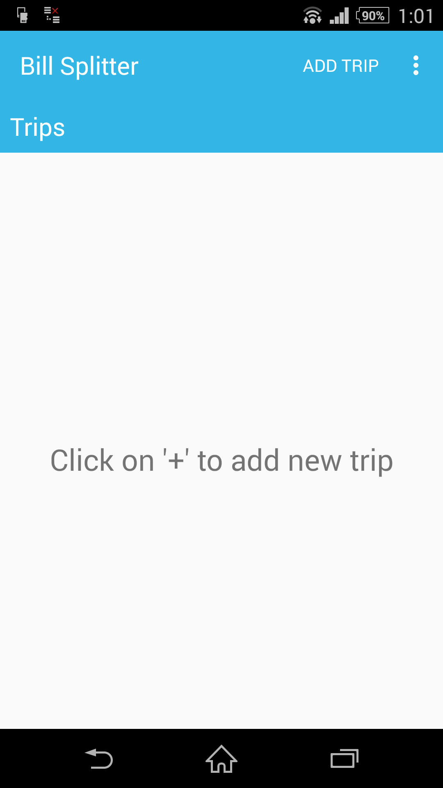
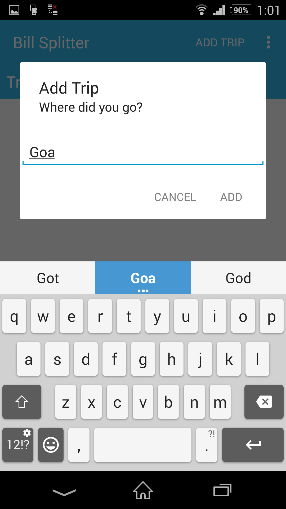
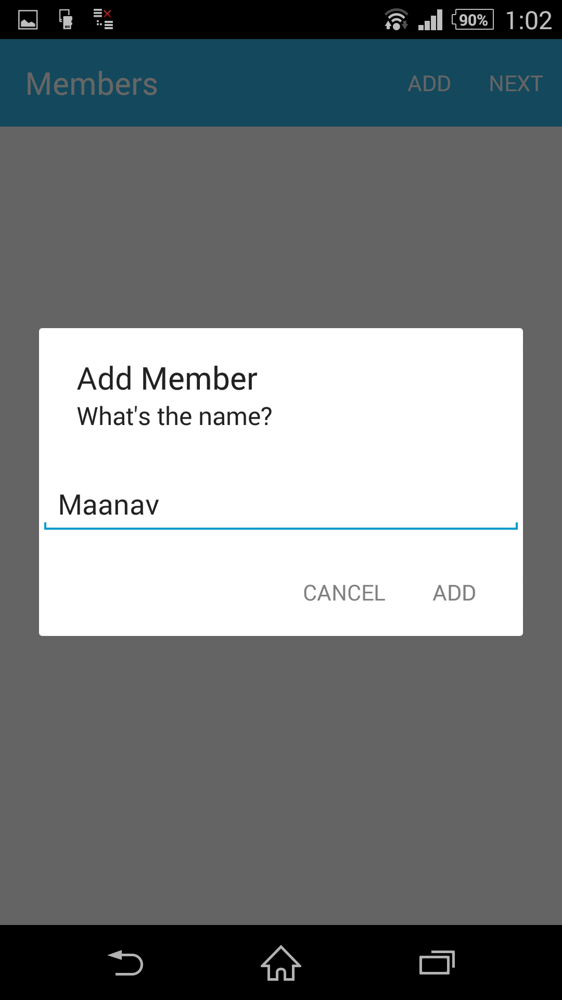
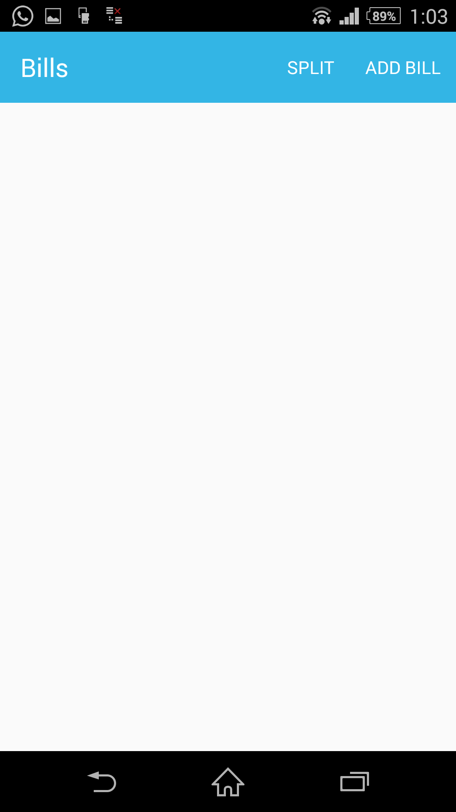
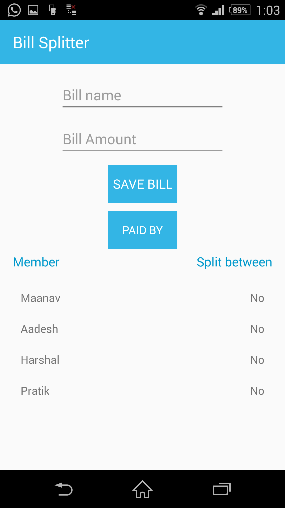
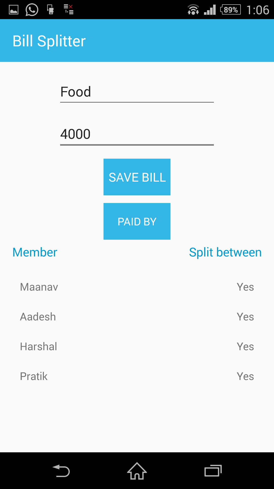
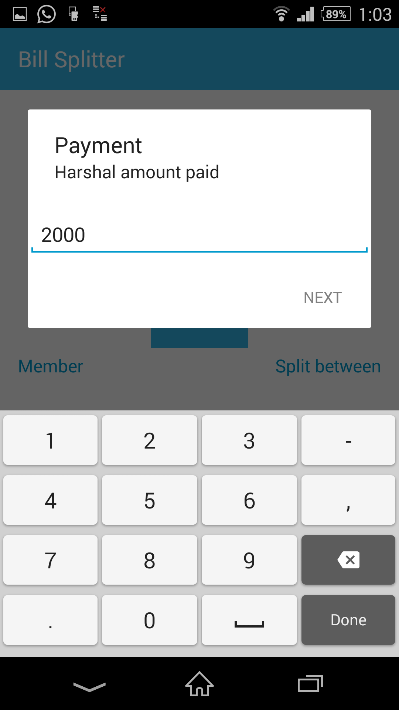
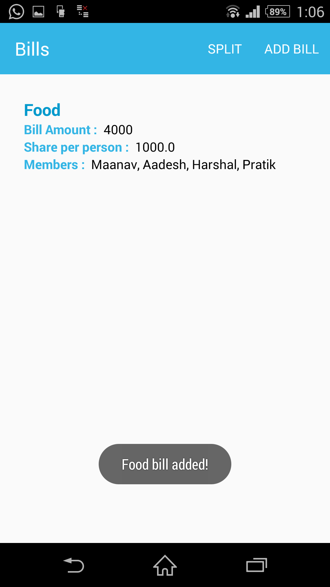
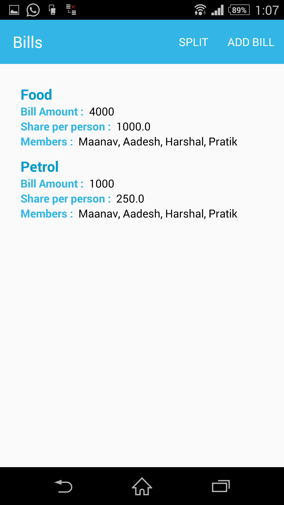
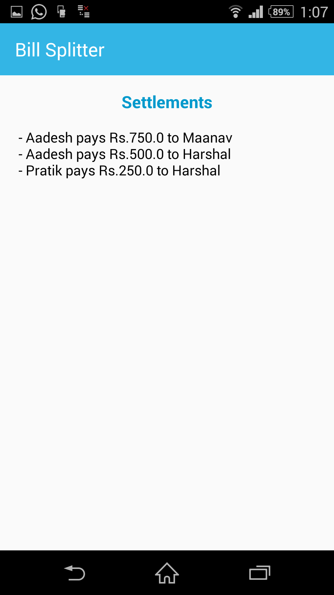

# billsplitter
An android application that splits trip and restaurants bill.

### Introduction

You've just finished a big meal with a big group of people. Everyone is full and happy, but ready to go home. You ask for the bill, and now, instead of relaxing after a great meal, you're scratching your head trying to do complicated math so that each person only pays for what they're responsible for. This app makes the process of splitting a complicated  bill much easier by guiding you through it in a step-by-step manner and displaying detailed results on-screen for everyone to see.

### Description

All you need is your bill and your Android mobile device!  You can either split the entire bill evenly among all of your party members, or you can go through each line item and select one or more party members to pay for it.  You can even split an individual line item up so that party members only pay for the quantity they are responsible for!

##### Split a Bill Evenly

To split a bill evenly among all party members, simply tap the "Evenly" button on the home screen.  Next, type in the grand total (after tax) at the bottom of your bill.  Select the number of people in your party, then tap the "Split" button.  Your results will be displayed at the bottom of the screen.

##### Split a Bill by Line Item

To split a bill so that each party member only pays for the line items they are responsible for, just tap the "By Line Item" button on the home screen.  On this screen, you can tap the "Edit Party" button to add and remove members from your party, or you can tap the "Edit Bill" button to add and remove line items from your bill.  Once you've finished creating your party and bill, type in the local sales tax percentage and press the "Split" button.  You will be asked to select one line item at a time from your bill.  For each selected line item, you will be asked to select the party member(s) who are responsible for it.  You can then choose to split the total cost of the selected line item evenly among the selected party members, or break it down further so that each member only pays for the quantity they are responsible for.  Once you've finished assigning payments to each line item on your bill, you can either edit a line item by selecting it again or just press the "Finish" button to return to the main screen and show the amount each party member is responsible for, as well as a handy tip guide.

### Features

* Uses Greedy Approach
  * First satisfies the person who has to take the most from the person who has to give the most by keeping balance (Calculate balance - AddBillActivity.java)
  * Recursively do that until all are satisfied (Calculate Settlements - SplitActivity.java)
* Small size apk
* Easy-to-use and user-friendly

### Support

- Android 4.0 +

### Installation

To build and run the app, clone this project, open it as an existing project in Android Studio, and click Run.

### Contributing

Bug reports and pull requests are welcome on GitHub at https://github.com/maanavshah/billsplitter. This project is intended to be a safe, welcoming space for collaboration, and contributors are expected to adhere to the [Contributor Covenant](http://contributor-covenant.org) code of conduct.

### License

The content of this repository is licensed under [MIT LICENSE](LICENSE).

### Screenshots

